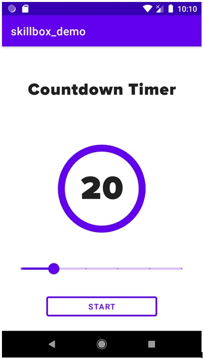
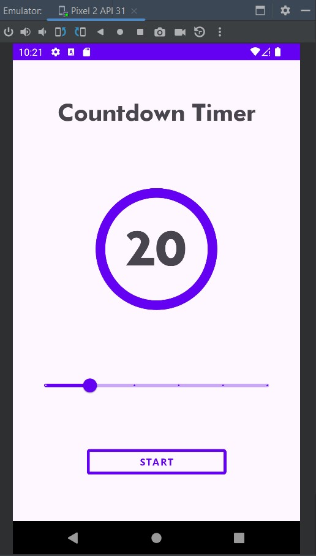
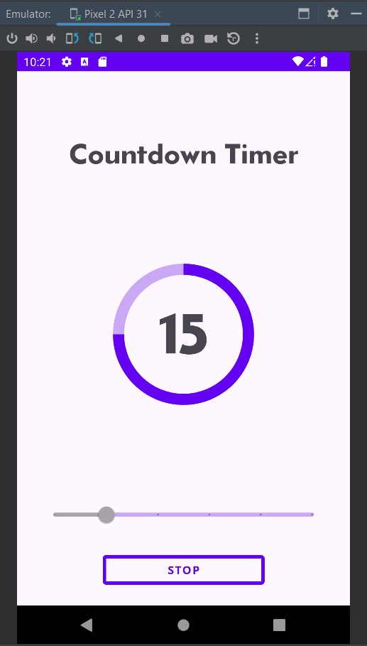
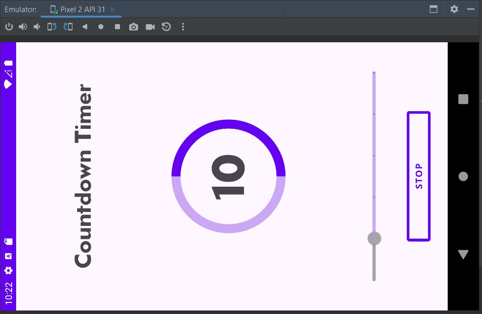

# Урок 10. Жизненный цикл приложения

Цель практической работы
Применить знания по жизненному циклу приложения и сохранению состояния при смене конфигурации.

Что входит в работу
- Разработать приложение «Таймер обратного отсчёта».
- Доработать приложение «Таймер обратного отсчёта».

Задание 1. 
Разработка приложения «Таймер обратного отсчёта»
Что нужно сделать
Разработайте приложение «Таймер обратного отсчёта» с использованием TextView, ProgressBar, 
Button, SeekBar/Slider.
1. Создайте пустой Android-проект.
2. Подготовьте стили и темы, необходимые для проекта, добавьте ресурсы; создайте drawable, 
который будет использоваться для отображения прогресса в компоненте ProgressBar.
3. Сверстайте layout. Сверху — текст, по центру — ProgressBar, внутри него — TextView для отображения прогресса. 
Ниже — SeekBar/Slider для установки времени. В самом низу — outlined Button для старта и остановки таймера. 
4. Опишите логику программы в главном Activity.

Пример экрана приложения:

=============================================================================

## Демонстрация решения:

